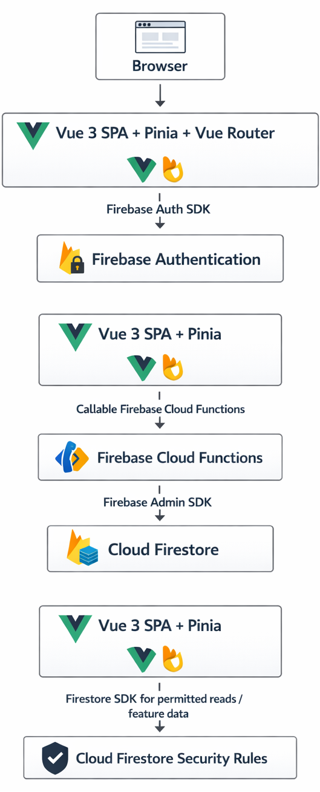

  # Final Project Report

  **Course:** Web Architecture Design and Implementation

  **Project Title:** Study Group Planner

  **Team Name:** It Works on My Machine

  **Team Members & Roles:**

  > **Chris Sloma** - Auth, Security, and Backend Architecture Lead

  > **Lloyd Nguyen** - Tasks, Dashboard, and Data Flow Documentation Lead

  > **Lilly Jackson** - Groups and Shared Collaboration Features Lead

  > **Amine Gamdou** - Sessions and Scheduling Features Lead

  **Repository URL:** *[Insert GitHub URL]*

  **Deployment URL:** *[Insert Live URL]*

  **Submission Date:** *[Insert Date]*

  # 1. Executive Summary

  ## 1.1 Project Overview

  The **Study Group Planner** is a full-stack web application that allows students to:

  * Create and join study groups
  * Share updates in a group feed
  * Schedule study sessions
  * Maintain a private personal task list
  * View aggregated information in a dashboard
  * Create and manage an authenticated user profile

  The system demonstrates modern web architecture principles including:

  * Frontend-backend separation
  * Authenticated multi-user support
  * Cloud database integration
  * Backend-mediated profile write operations
  * Firestore security rules for private user data
  * Public deployment readiness

  ## 1.2 Core Application Features

  ### Minimal Viable Product

  Groups:

  * Create group
  * Join group
  * See group updates
  * Leave group
  * Delete group if owner
  * Create posts within shared groups
  * Include username, date created, title, and body

  User Authentication:

  * Create account
  * Login and logout
  * Password reset
  * Google sign-in
  * Profile management
  * Protected routes

  User Interface:

  * Consistent layout across Dashboard, Groups, Sessions, Profile, and Login
  * Consistent color design
  * Status pages for unauthorized and not-found routes

  Dashboard:

  * Review user tasks
  * Display groups
  * Display upcoming sessions
  * Provide navigation to main application sections

  Personal Tasks:

  * Create personal tasks
  * Have title, completion mark, delete task, and reminder date
  * Edit personal tasks
  * Filter personal tasks
  * Sort by date and alphabetically

  Study Sessions:

  * Create sessions
  * Modify sessions
  * Send invite or provide meeting link
  * Delete sessions

  Nice to have:

  * Profile picture for each user
  * Filtering for groups
  * Search for group posts
  * Expanded role-based permissions

  ### Authentication & Authorization

  * User registration, login, logout
  * Password reset
  * Google authentication
  * Protected routes
  * Backend-mediated user profile creation, update, and deletion
  * Firestore rules for private user profile access

  ### Groups

  * Create group
  * Join via join code
  * Leave group
  * View group members
  * View shared feed

  ### Group Feed

  * Shared stream per group
  * Create posts
  * Edit/delete own posts
  * View all group posts

  ### Study Sessions

  * Create session with title, date/time, and location or link
  * View upcoming sessions
  * Delete sessions with permission rules

  ### Personal Tasks

  * Create, edit, and delete tasks
  * Mark complete
  * Owner-only visibility

  ### Dashboard

  * Display user's groups
  * Display upcoming sessions
  * Display task reminders

  # 2. System Architecture

  ## 2.1 High-Level Architecture Overview

  The Study Group Planner follows a three-layer cloud-backed architecture:

  1. **Frontend Layer** - Vue 3, Vue Router, Pinia, and Vuetify
  2. **Backend Service Layer** - Firebase Cloud Functions
  3. **Cloud Data Layer** - Firebase Authentication and Cloud Firestore

  Firebase Authentication manages user identity. Firebase Cloud Functions provide backend-mediated operations for sensitive user profile writes. Cloud Firestore stores application data, including user profiles,
  tasks, groups, sessions, and group feed records.

  ## 2.2 Architecture Diagram

  

  ## 2.3 Frontend Responsibilities

  - Component-based UI rendering
  - Client-side validation
  - Pinia state management
  - Vue Router navigation and route protection
  - Firebase Auth login, signup, logout, password reset, and Google sign-in
  - Calling Firebase Cloud Functions for backend-mediated profile writes
  - Reading permitted Firestore data according to security rules

  ## 2.4 Backend Responsibilities

  The backend service layer is implemented with Firebase Cloud Functions.

  Backend responsibilities include:

  - Creating user profile documents after Firebase Auth signup or Google login
  - Updating editable user profile fields
  - Deleting user profile documents
  - Using Firebase Auth context to identify the signed-in user
  - Using Firebase Admin SDK for trusted Firestore writes
  - Preserving protected fields such as uid, email, and role
  - Preventing frontend-controlled privilege escalation

  The implemented callable functions are:

  | Function | Description |
  | -------- | ----------- |
  | createUserProfile | Creates or returns users/{uid} after authentication |
  | updateUserProfile | Updates editable profile fields for the signed-in user |
  | deleteUserProfile | Deletes the signed-in user's Firestore profile |

  ## 2.5 Database Responsibilities

  Cloud Firestore provides:

  - Persistent cloud storage
  - Structured collections
  - Security rules for private and shared data
  - Indexed queries
  - Data separation between private user data and shared collaboration data

  # 3. Frontend Architecture

  ## 3.1 Technology Stack

  - Vue 3
  - TypeScript and JavaScript
  - Pinia for state management
  - Vue Router
  - Vuetify
  - Firebase Web SDK
  - Sass

  ## 3.2 Component-Based Structure

  High-level structure:

  App
    AuthLayout
      LoginView
    SiteLayout
      DashboardView
      GroupsView
      SessionsView
      ProfileView
    StatusPage
      UnauthorizedView
      NotFoundView

  The application uses shared layout components for authenticated and unauthenticated pages. The site layout contains the main navigation and user menu. The auth layout is used for login and signup.

  ## 3.2.1 Status Page Pattern

  The 403 Unauthorized and 404 Not Found routes use the same shared Vue component for layout and styling.

  Each route view keeps a local statusPageData object with the page-specific code, label, heading, message, recovery notes, and available actions. That object is passed into StatusPage.vue, which renders the
  shared layout, loops through notes and actions with Vue, and conditionally shows a Go back action when browser history is available.

  ## 3.3 State Management

  Pinia is used to manage:

  - Authentication state
  - User profile state
  - Groups state
  - Tasks state

  The authentication store manages Firebase Auth state, profile loading, signup, login, logout, password reset, Google sign-in, profile update, and account deletion.

  # 4. Backend Architecture

  ## 4.1 Technology Stack

  - Firebase Cloud Functions
  - Node.js runtime
  - Firebase Admin SDK
  - Firebase Authentication
  - Cloud Firestore
  - Firebase callable functions

  ## 4.2 Callable Function Overview

  The backend uses Firebase callable functions instead of a traditional REST API. Callable functions are invoked from the frontend using the Firebase Functions SDK.

  ### Authentication/Profile Functions

  | Callable Function | Description |
  | ----------------- | ----------- |
  | createUserProfile | Creates a Firestore profile document for a signed-in user |
  | updateUserProfile | Updates editable profile fields for the signed-in user |
  | deleteUserProfile | Deletes the signed-in user's Firestore profile document |

  ### Why Callable Functions Were Used

  Callable functions were selected because the project already uses Firebase Authentication and Cloud Firestore. Callable functions automatically receive Firebase Auth context from signed-in users, reducing the
  need for custom token parsing middleware. This keeps the backend service layer smaller while still enforcing backend-mediated writes for sensitive profile operations.

  ## 4.3 Business Logic Separation

  The frontend does not directly write user profile data after the Cloud Functions integration.

  Profile write operations are mediated by backend functions:

  - Profile creation is handled by createUserProfile
  - Profile updates are handled by updateUserProfile
  - Profile deletion is handled by deleteUserProfile

  The backend uses the authenticated user's UID from Firebase Auth context rather than trusting a user ID sent from the frontend.

  The backend preserves protected fields:

  - uid
  - email
  - role

  The user can edit normal profile fields:

  - username
  - firstName
  - lastName
  - studyMajor

  # 5. Database Design

  ## 5.1 Database Technology

  Firebase Cloud Firestore

  ## 5.2 Collections

  ### Users

  Stored at:

  users/{uid}

  Current user profile shape:

  {
    uid,
    username,
    email,
    firstName,
    lastName,
    studyMajor,
    groups: [],
    role,
    createdAt,
    updatedAt
  }

  The uid and email values are tied to Firebase Authentication. The role field is read-only from the profile page and is preserved by backend functions.

  ### Groups

  Planned/shared group shape:

  {
    name,
    description,
    joinCode,
    ownerId,
    memberIds: [],
    createdAt,
    updatedAt
  }

  ### GroupFeed

  Planned group feed shape:

  {
    groupId,
    title,
    body,
    createdBy,
    createdAt,
    updatedAt
  }

  ### Sessions

  Planned session shape:

  {
    groupId,
    title,
    startsAt,
    locationOrLink,
    createdBy,
    createdAt
  }

  ### Tasks

  Current task data uses the Tasks collection.

  Task shape:

  {
    user,
    id,
    description,
    date,
    isCompleted,
    isHidden
  }

  ## 5.3 Data Separation

  ### Private Data

  - User profile information
  - Personal tasks

  ### Shared Data

  - Groups
  - Group feed posts
  - Study sessions

  User profile data is protected by Firestore rules. Users can read only their own profile document. Direct frontend writes to profile documents are blocked and must go through Cloud Functions.

  ## 5.4 Firestore Security Rules

  Firestore rules are version-controlled in:

  firestore.rules

  Rules are deployed with:

  firebase deploy --only firestore:rules

  Current users rule:

  match /users/{userId} {
    allow read: if request.auth != null && request.auth.uid == userId;
    allow write: if false;
  }

  Current Tasks rule:

  match /Tasks/{taskId} {
    allow read, create, update, delete: if request.auth != null;
  }

  The users rule blocks direct client writes. Firebase Cloud Functions use the Firebase Admin SDK and are responsible for trusted profile writes.

  ## 5.5 CRUD Implementation

  | Feature | Create | Read | Update | Delete |
  | ------- | ------ | ---- | ------ | ------ |
  | User Profile | Cloud Function | Firestore owner read | Cloud Function | Cloud Function |
  | Auth Account | Firebase Auth | Firebase Auth | Limited by Firebase Auth | Firebase Auth |
  | Tasks | Firestore | Firestore | Firestore | Firestore |
  | Groups | In progress | In progress | In progress | In progress |
  | Sessions | Prototype | Prototype | Prototype | Prototype |
  | Feed | Planned | Planned | Planned | Planned |

  # 6. Authentication & Authorization

  ## 6.1 Authentication Strategy

  The application uses Firebase Authentication for identity management.

  Supported authentication features:

  - Email/password signup
  - Email/password login
  - Logout
  - Password reset
  - Google sign-in
  - Remember Me session persistence

  The frontend stores the current authenticated user profile in Pinia. Vue Router guards protect authenticated routes.

  ## 6.2 Profile Authorization

  Profile authorization is enforced in multiple layers:

  1. Firebase Auth identifies the signed-in user.
  2. Firestore rules allow users to read only users/{uid} where uid matches their Auth UID.
  3. Firestore rules block direct frontend writes to users/{uid}.
  4. Cloud Functions use request.auth.uid to decide which profile can be created, updated, or deleted.
  5. Cloud Functions preserve protected fields and do not allow users to edit their own role.

  ## 6.3 Route Authorization

  Routes that require login use route metadata:

  meta: { requiresAuth: true }

  The router waits for auth hydration before deciding whether the user can access a protected route. Unauthenticated users are redirected to the login page.

  The application also includes a 403 Unauthorized route for future role-based restrictions.

  # 7. Non-Functional Requirements

  ## 7.1 Security

  Security features include:

  - Firebase Authentication
  - Protected frontend routes
  - Cloud Functions for sensitive profile writes
  - Firebase Admin SDK for trusted backend database writes
  - Firestore rules that block direct client writes to user profiles
  - Read-only role field in the Profile UI
  - Password reset handled through Firebase Auth
  - Google sign-in through Firebase Auth

  ## 7.2 Scalability

  The application uses Firebase-managed services:

  - Firebase Authentication for identity
  - Cloud Firestore for scalable document storage
  - Firebase Cloud Functions for serverless backend operations

  This avoids managing a dedicated backend server while still providing a backend service layer.

  ## 7.3 Performance

  Performance considerations include:

  - Firestore queries scoped to user data where applicable
  - Pinia state management to avoid unnecessary repeated state handling
  - Vue Router route guards with auth hydration
  - Callable functions used only for sensitive profile write operations

  ## 7.4 Reliability

  Reliability features include:

  - Centralized auth state management
  - Backend validation for profile writes
  - Firestore rules deployed from a version-controlled rules file
  - Shared status page component for 403 and 404 routes
  - Error messages for login, signup, forgot password, and profile operations

  # 8. Deployment

  ## 8.1 Hosting Plan

  - Frontend: [TBD - e.g., Firebase Hosting, Vercel, or another static hosting provider]
  - Backend: Firebase Cloud Functions
  - Database: Firebase Cloud Firestore
  - Authentication: Firebase Authentication

  ## 8.2 Deployment Architecture

  The deployed architecture uses Firebase project:

  finalproject-2cac4

  Deployment files:

  .firebaserc
  firebase.json
  firestore.rules
  functions/

  Backend deploy command:

  firebase deploy --only functions

  Firestore rules deploy command:

  firebase deploy --only firestore:rules

  Frontend deployment command is dependent on the selected hosting provider.

  # 9. Development Process

  ## 9.1 Git Workflow

  - Single shared GitHub repository
  - Feature branches used for individual work
  - Integration through develop
  - Shared code review and merge testing
  - Git history used to verify team participation

  ## 9.2 Backend Integration Process

  The authentication/profile backend was integrated in stages:

  1. Firebase Auth was wired into the frontend.
  2. User profile model was added.
  3. Firebase Cloud Functions project files were added.
  4. createUserProfile was implemented and deployed.
  5. updateUserProfile was implemented and deployed.
  6. deleteUserProfile was implemented and deployed.
  7. Firestore rules were tightened to block direct frontend user profile writes.
  8. The frontend auth store was updated to call backend functions.

  # 10. Challenges & Engineering Decisions

  ## 10.1 Firebase Cloud Functions Instead of Express

  The original architecture considered a Node.js Express REST API. The implementation uses Firebase Cloud Functions instead.

  This decision was made because the project already uses Firebase Authentication and Cloud Firestore. Callable Cloud Functions provide a backend service layer while integrating directly with Firebase Auth
  context and Firebase Admin SDK.

  This reduced the amount of custom backend infrastructure needed while still satisfying the requirement for backend-mediated sensitive write operations.

  ## 10.2 Callable Functions Instead of REST Endpoints

  The backend uses callable functions rather than explicit GET, POST, PUT, and DELETE endpoints.

  Callable functions still provide a backend service layer. They are invoked through the Firebase Functions SDK and run in a trusted server environment. This approach avoids manually passing and verifying ID
  tokens in custom Express middleware.

  ## 10.3 Firestore Rules as Source of Truth

  Firestore rules are maintained locally in firestore.rules and deployed using Firebase CLI. This keeps security rules version-controlled and reviewable.

  ## 10.4 Role Editing

  The user model includes roles, but users cannot edit their own role from the Profile page. Backend functions preserve the existing role value and prevent self-promotion.

  Admin role management is considered future work.

  # 11. Future Improvements

  - Full backend mediation for groups, sessions, feed, and tasks
  - Expanded role-based authorization
  - Admin interface for role management
  - Notifications for upcoming sessions
  - Real-time group feed updates
  - Pagination for feed posts
  - More detailed validation in Cloud Functions
  - Automated tests
  - CI/CD deployment pipeline
  - Frontend code splitting to reduce Vite chunk-size warnings

  # 12. Conclusion

  The Study Group Planner demonstrates:

  - Clear frontend/backend separation
  - Firebase Authentication for multi-user identity
  - Firebase Cloud Functions as a backend service layer
  - Backend-mediated user profile creation, update, and deletion
  - Firestore security rules for private user profile data
  - Pinia-based frontend state management
  - Vue Router protected routes
  - Cloud Firestore integration
  - Component-based frontend architecture
